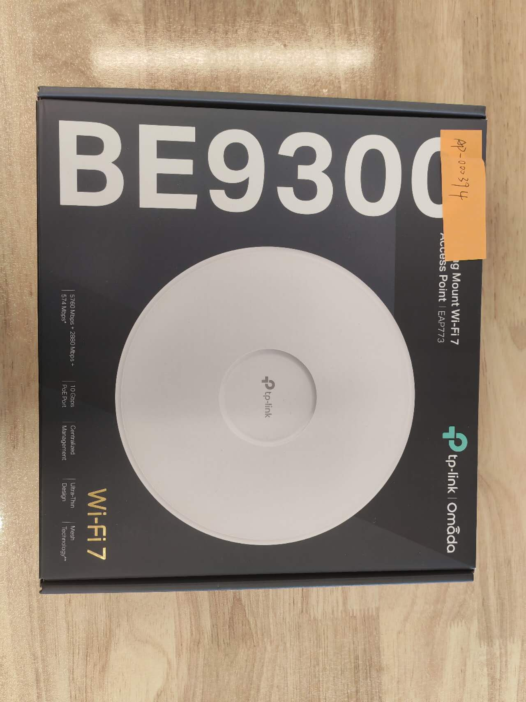
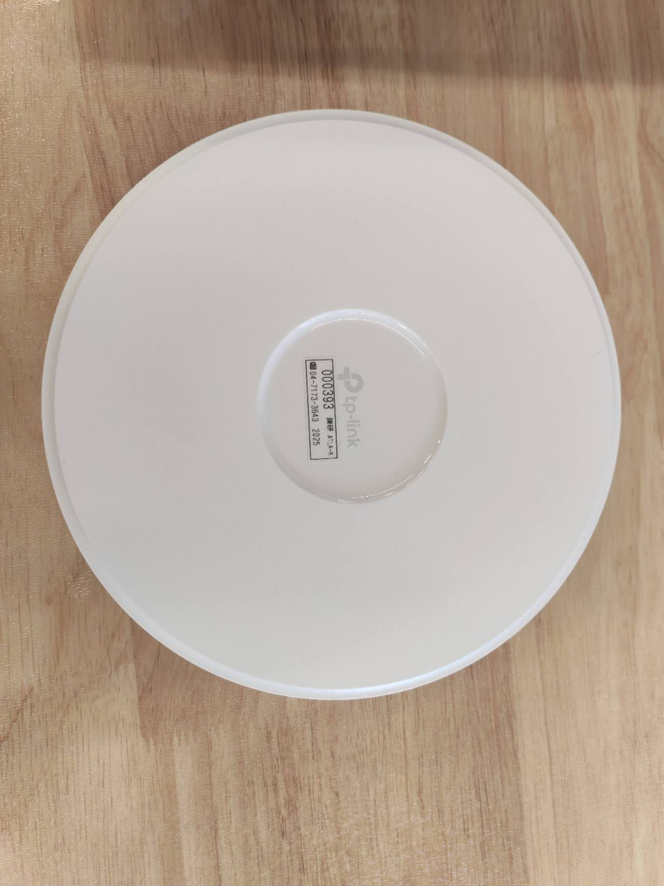
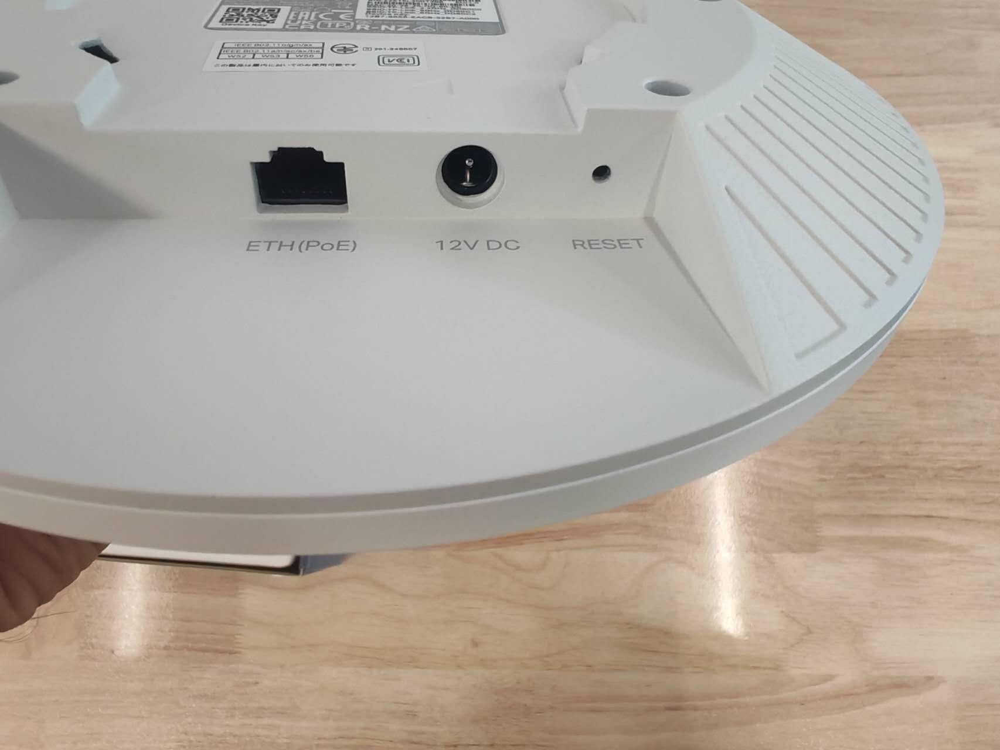
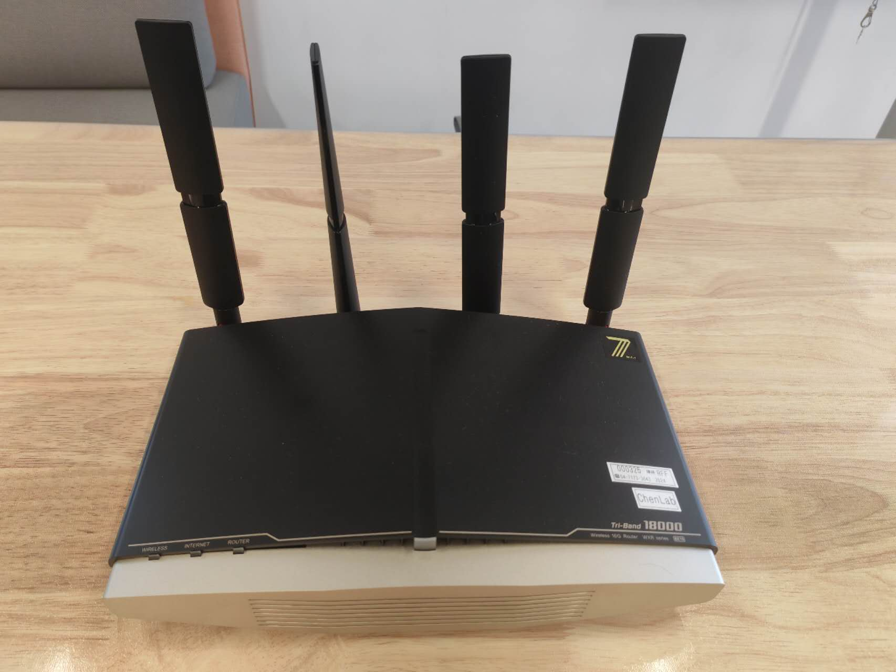
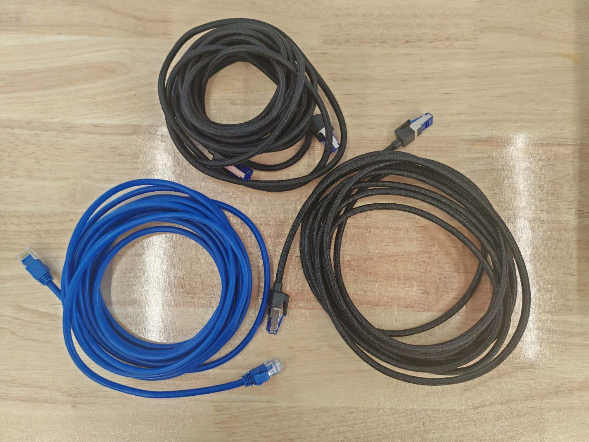

# Device Inventory

## Quick List
1. Wireless Access Points ×2  
2. Wireless Router ×1  
3. Power Cables ×1  
4. Ethernet Cables ×3  
5. SSID and Password Labels ×1  
6. QR Code for Deployment Guide ×1  

---

## 1. Wireless Access Points ×2
**Model:** TP-Link Omada EAP713  
**Bands:** 2.4 GHz / 5 GHz / 6 GHz  
**Features:**  
- Centralized management via Omada Controller  
- PoE powered (no extra power brick required if PoE switch is available)  
- WPA2/WPA3 mixed mode support for old and new devices  
- High-density design, supports 200+ clients  

  
  
  

---

## 2. Wireless Router ×1
**Model:** Buffalo Wi-Fi 7 WXR18000BE10P  
**Functions:**  
- Provides NAT and DHCP services for the entire network  
- Supports Wi-Fi 7, high throughput, stable for events  
- Handles up to 200+ IP clients  
- Acts as the upstream gateway for APs  

---

## 3. Power Cables ×1
**Type:** Standard AC adapters  
**Purpose:** To power APs (if not using PoE)  

  

---

## 4. Ethernet Cables ×3
**Specification:** Cat6a or above  
**Functions:**  
- Provide PoE (Power over Ethernet) to APs  
- Ensure gigabit+ speed transmission  

  

---

## 5. SSID and Password Labels ×1
**Purpose:**  
- Printed labels with pre-configured SSID and Wi-Fi password  
- Stick on walls or desks for participants  

  

---

## 6. QR Code for Deployment Guide ×1
**Purpose:**  
- Printed QR code linking to the GitHub repository  
- Repository contains:  
  - Full setup guide  
  - Deployment steps  
  - Troubleshooting documentation  

  
